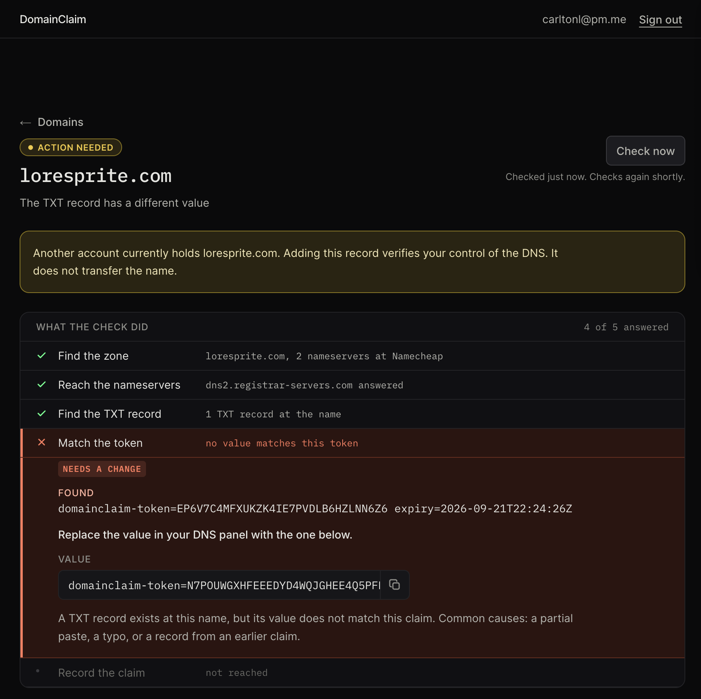

# DomainClaim

Claim a domain, prove you control it, and see what is happening at every step.

Most verification is opaque: paste a record, wait 48 hours, check back. This asks your zone's
authoritative nameservers directly and reports what each one answered. Every failure names a reason
and one next action. Ownership is persistent state, so the claim keeps being checked after it
verifies.

Live at [domainclaim-pi.vercel.app](https://domainclaim-pi.vercel.app). Take-home for Resend.
Decisions are in [docs/RFC.md](docs/RFC.md).



## Try it

Fastest tour: sign in, which lands on an empty list of your claims. Claim `record-not-found.test` to
see the record and the check that has nothing to find yet, then claim `verified.test` to watch a
claim prove itself. `appended-zone.test` is the one to look at for how failures are explained.

Sign in with a link sent to your address. No password.

Claim a real domain, or use a demo name below. Each routes to a scripted resolver, so every outcome
is reachable without owning a broken domain. `.test` is reserved by RFC 6761 and can never be a real
claim.

| Name | What it shows |
| --- | --- |
| `verified.test` | Record found, claim verifies |
| `crowded-name.test` | Found among other services' TXT records |
| `one-dead-nameserver.test` | A zone with a dead secondary, which verifies at the speed of the live ones |
| `record-not-found.test` | Nothing at the name, with the negative cache window |
| `no-txt-at-name.test` | Name exists, no TXT on it, and the zone is not answering for everything |
| `appended-zone.test` | The panel appended the domain, so the record landed one level down |
| `value-mismatch.test` | A TXT record carrying a token this claim did not issue |
| `nameservers-unreachable.test` | No answer inside the deadline |
| `zone-not-found.test` | No level answers with nameservers |
| `slow-nameservers.test` | Alive but past the deadline, which reads the same as down |

## How it works

- Checks go straight to the zone's authoritative nameservers over UDP/53. Those do not cache, so a
  record shows up as soon as it is saved. Public resolvers lag by the zone's negative cache window,
  and the failure says by how much.
- It walks up from the record's name to find the zone. A delegated subdomain has its own
  nameservers, and the parent's would be wrong.
- Every nameserver is asked at once and one answer is enough. A server still running when the answer
  arrives is reported as unfinished.
- One account holds a name at a time, enforced by a partial unique index over the states that hold
  it. Several accounts can hold a pending attempt, and the first to prove control wins. Transfers
  build on that.
- The token is public. It sits in a TXT record anyone can query, so its only job is being
  unguessable. 160 bits from `crypto.randomBytes`.
- No Verify button. A check takes about 250ms, so the product runs it, and keeps running it while
  the claim is open: 5s, 15s, 30s, 60s, then every minute, stopping after fifteen and saying so.
  Check now is for the person who has just saved the record and does not want to wait for the next
  one. Both are rate limited, per claim and per account.
- The check reports itself as five steps, each carrying the answer it got: find the zone, reach the
  nameservers, find the TXT record, match the token, record the claim. A step that has not passed is
  not the same as one that has gone wrong, and they are drawn differently: if the next move belongs
  to the person it is a failure, if it belongs to time it is still waiting.
- A failed check asks two follow-up questions. Nothing at the name means asking for the name with the
  zone on the end of it twice, which catches a panel that appended its zone. No TXT at the name means
  asking for a name nobody could have created, which catches a wildcard zone answering for
  everything, where a record that was never added otherwise looks like one saved under the wrong
  type.
- Failures are typed values, rendered as a title, the DNS value at fault, why, and one next action.
- One vantage point, which is the weakest part of this. The check runs from one region, so a failure
  means either the record is missing or our own view of DNS is wrong, and the screen states the
  first of those as fact. Measured on 2026-09-14: a dev server and the deployment disagreed about a
  real record for two hours, and the wrong one sounded certain. Two paths disagreeing is the only
  thing that can express doubt, which is what the second opinion below is for.
- The list of an account's claims runs no check. A row's state is the claim's own, read from the
  database, so opening the list costs one query however many names are in it. A check belongs on the
  screen someone opened to act on the answer.

## Scope

Built:

- Magic link sign in
- Domain input, normalized, with a typed error for every way a name can be wrong
- Claim issue with a scoped token, and the record to add
- The check, run on arrival and again on a cadence, against real DNS, reported as its five steps
- Check now, at a rate limited endpoint
- Seven of nine failure reasons, each with one action and the remediation in the step that produced it
- The list of an account's claims, including the ones not proved yet
- Releasing a claim

Not built yet:

- The five steps arriving one at a time, with the waiting ring animating while one is in flight
- Scheduled re-verification, grace window, notification email
- Transfers for a contested name
- A second opinion over DNS-over-HTTPS. It separates a CNAME at the name and broken DNSSEC from the
  failures above, and shows how far behind public resolvers are while they catch up. Its larger job
  is doubt, for the reason in the section above

Out of scope, reasoning in the RFC: verification methods other than TXT, sending mail and its
records, teams and roles, a public API, internationalized copy.

## Running it

```bash
pnpm install
cp .env.example .env.local
pnpm dev
```

Node 24.x. Needs a Supabase project and a Resend API key. Every variable is documented in
`.env.example`.

| Command | What it does |
| --- | --- |
| `pnpm dev` | Development server |
| `pnpm build` | Production build |
| `pnpm verify` | Biome, TypeScript, Vitest and the build, in one command |
| `pnpm test` | Vitest unit tests |
| `pnpm typecheck` | TypeScript with no emit |
| `pnpm check` | Biome lint and format check |
| `pnpm format` | Biome check with fixes applied |
| `pnpm db:generate` | Write a migration from the schema |
| `pnpm db:migrate` | Apply pending migrations |

## Tests

CI runs `pnpm verify` on every pull request, with no secrets, because nothing reads an environment
variable at module scope.

350 unit tests, concentrated in the pure layers: input normalization, the DNS trace, the
comparison against a claim, the step list and every user-facing string. The DNS layer sits behind an
interface with a scripted fake, so no test touches the network.

The coverage is deliberately lopsided and the gap should be named. The database layer needs a real
Postgres and has no automated tests, and three of the bugs found in review lived there. It is covered
by a manual pass, and in-process Postgres is queued.

## Documents

- [docs/RFC.md](docs/RFC.md). Decisions, reasoning, open questions.
- [docs/FRICTION_LOG.md](docs/FRICTION_LOG.md). Every confusion hit using this against a real
  domain, each resolved, deferred or accepted.
- [docs/POLISH_BACKLOG.md](docs/POLISH_BACKLOG.md). Ideas held back on purpose, with what each costs
  and buys.
