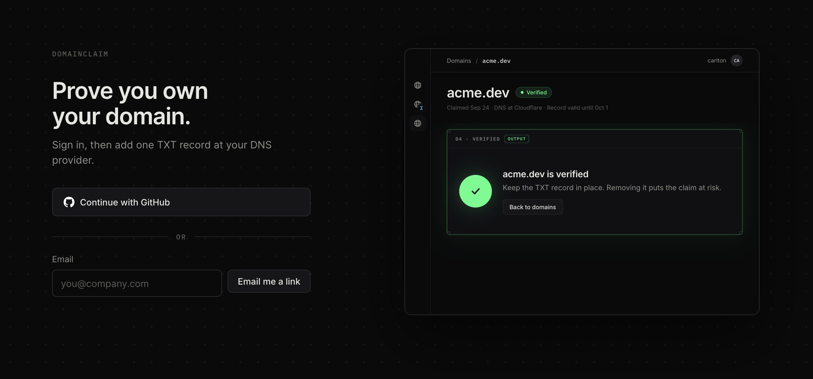

# DomainClaim

Claim a domain, prove you control it, and see what is happening at every step.

Most verification is opaque: paste a record, wait 48 hours, check back. This asks your zone's
authoritative nameservers directly and shows the check as five steps as they land. Every failure
names a reason and one next action. Ownership keeps being checked after it is proved: a name whose
record stops answering moves to At risk on the next check, and back when the record returns.

Live at [domainclaim-pi.vercel.app](https://domainclaim-pi.vercel.app). Take-home for Resend.
Decisions are in [docs/RFC.md](docs/RFC.md). A five minute walkthrough of the product and the
process is on [Loom](https://www.loom.com/share/bf1c008566fd44dba68fd82532dc9c5d) (OLD UI).



## Five minutes

1. Sign in with GitHub, or with a link sent to your address. No password. Sign in lands on an empty
   list.
2. Open Demo names under the claim input and pick `record-not-found.test`. Claim it. The claim
   screen shows the record to add, and the check keeps running on its own: nothing at the name yet,
   so it waits.
3. Claim `verified.test` and watch the five steps pass. Claim `value-mismatch.test`: the step that
   stopped carries the four part message, with the part of the value that differs marked, the
   value to use, and one thing to do.
4. Open the list. The claims read Pending, Verified and Action needed, needs attention first, with
   a notice counting them. Refresh reads the list again. A claim is checked on its own screen.
5. Claim `flaky.test`. It verifies. Open it again and it reads At risk. Press Check now and it
   recovers, with how long the record was missing.
6. Read the ten headline decisions at the top of [Decisions in the RFC](docs/RFC.md#decisions).

## Demo names

Every `.test` name routes to a scripted resolver, so each outcome is reachable without owning a
broken domain. `.test` is reserved by RFC 6761 and can never be a real claim. The switch is
`DOMAINCLAIM_TEST_NAMESPACE=on`, which is on for the deployment above. Off, `.test` is refused like
any other special-use name. Demo names, under the claim input, lists every name and fills the
field. Claim a real domain too; the check goes to your zone's authoritative nameservers.

| Name | Outcome | What the script does |
| --- | --- | --- |
| `verified.test` | Verifies | All three nameservers return the record |
| `record-not-found.test` | Waits | The zone answers. Nothing is at the name yet |
| `value-mismatch.test` | Needs a change | A TXT record is there with another token |
| `appended-zone.test` | Needs a change | The record landed with the domain added twice |
| `no-txt-at-name.test` | Needs a change | The name exists with no TXT record on it |
| `other-txt.test` | Waits | Another service's TXT record is at the name. Ours isn't |
| `crowded-name.test` | Verifies | The record sits beside SPF and Google records |
| `one-dead-nameserver.test` | Verifies | One of three nameservers hangs. The other two answer |
| `zone-not-found.test` | Needs a change | No nameservers at any level |
| `nameservers-unreachable.test` | Waits | No nameserver answers inside the deadline |
| `slow-nameservers.test` | Waits | The nameservers answer after the deadline |
| `expired.test` | Needs a change | Created with its token already expired |
| `flaky.test` | Flips | The record flips on every check: verified, At risk, recovered |

`slow-nameservers.test` and `nameservers-unreachable.test` render the same screen. Both miss the
two second deadline, so from here slow and down look the same.

## What to read next

- [docs/RFC.md](docs/RFC.md): every decision with its reason, the state model, the open questions.
- [docs/FRICTION_LOG.md](docs/FRICTION_LOG.md): fifty entries from using it against a real domain,
  which is where most of the product was designed.
- [docs/TRANSFERS.md](docs/TRANSFERS.md): the feature RFC for moving a name between accounts,
  designed and not built, with a prototype.
- [docs/POLISH_BACKLOG.md](docs/POLISH_BACKLOG.md): ideas held back on purpose, with what each costs
  and buys.
- Five files, if the code is where you want to start. `src/lib/dns/trace.ts` asks DNS and reports
  what each server said. `src/lib/claims/evaluate.ts` compares that with the claim and decides what
  the row should do. `src/lib/claims/steps.ts` turns a check into the five steps.
  `src/lib/claims/store.ts` holds every write, each conditional on the state it read.
  `src/lib/dns/testNames.ts` scripts the demo names.

## Scope

Built:

- Sign in with GitHub in one click from the home page, or by email link
- Domain input, normalized, with a typed error for every way a name can be wrong
- Claim issue with a scoped token, and the record to add
- The check, run on arrival and again on a cadence, against real DNS, streamed as its five steps
- Check now, at a rate limited endpoint
- Favicons for claimed names, fetched server side behind SSRF guards
- At risk when a held name loses its record, and recovery when it comes back
- Action needed, on the list and the claim screen, for a claim whose next move is the person's
- Seven of nine failure reasons, each with one action and the remediation in the step that produced it
- The list of an account's claims, including the ones not proved yet, with filter, sort, and a
  notice for names that need attention
- Releasing a claim, from its own screen or the list
- Demo names, a menu of the scripted `.test` names under the claim input

Not built yet:

- Scheduled re-verification. A name that loses its record while nobody has it open goes unnoticed
  until somebody opens it
- The grace window and the notification email, which both sit behind that schedule, so At risk has
  no exit to Revoked
- Transfers for a contested name, when a second account proves control of a name someone else
  holds. `contested` and `revoked` are modelled and nothing writes them. Designed in
  [docs/TRANSFERS.md](docs/TRANSFERS.md)
- A second opinion over DNS-over-HTTPS. It separates a CNAME at the name and broken DNSSEC from the
  failures above, and shows how far behind public resolvers are while they catch up. Its larger job
  is doubt, for the reason in the section above

Out of scope, reasoning in the RFC: verification methods other than TXT, sending mail and its
records, teams and roles, a public API, internationalized copy.

## Running it

```bash
pnpm install
cp .env.example .env.local
pnpm db:migrate
pnpm dev
```

Node 24.x. Needs a Supabase project with the GitHub provider turned on, and a Resend API key. Every
variable is documented in `.env.example`. Set `DOMAINCLAIM_TEST_NAMESPACE=on` for the demo names.

| Command | What it does |
| --- | --- |
| `pnpm dev` | Development server |
| `pnpm build` | Production build |
| `pnpm verify` | Biome, TypeScript, Vitest and the build, in one command |
| `pnpm test` | Vitest unit tests |
| `pnpm typecheck` | TypeScript with no emit |
| `pnpm check` | Biome lint and format check |
| `pnpm format` | Biome check with fixes applied |
| `pnpm db:generate` | Write a migration from the schema |
| `pnpm db:migrate` | Apply pending migrations |

## Tests

CI runs `pnpm verify` on every pull request and push to main, with no secrets, because nothing reads an environment
variable at module scope.

615 unit tests, concentrated in the pure layers: input normalization, the DNS trace, the
comparison against a claim, the state each check leaves the claim in, the step list, the streamed
check and every user-facing string. The DNS layer sits behind an interface with a scripted fake, so
no test touches the network.

The coverage is deliberately lopsided and the gap should be named. The database layer needs a real
Postgres and has almost no automated tests, and four of the bugs found in review lived there. It is
covered by a manual pass, and in-process Postgres is queued. The one test it does have is the
function that decides whether an error is Postgres refusing a duplicate, which needs no database
because it runs before anything is written.
